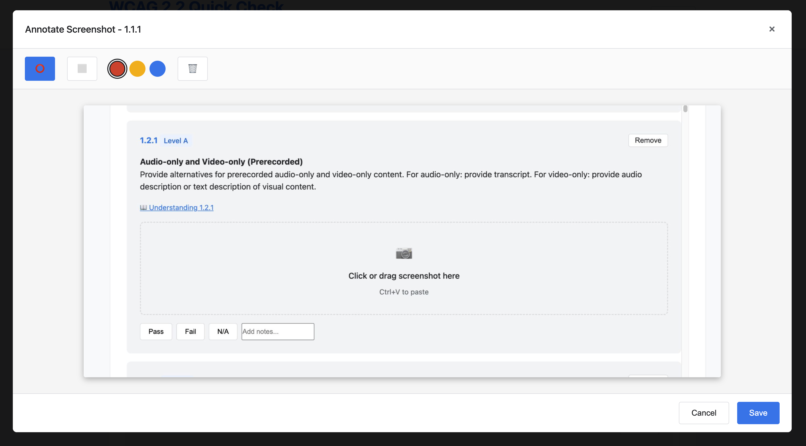

# WCAG 2.2 Quick Check App

**🚀 [Try the Live App](https://grundhofer.github.io/wcag-quick-check/)**

A web-based accessibility testing tool that helps evaluate websites against WCAG 2.2 Level A and AA criteria. The app uses smart filtering questions to reduce the number of applicable criteria based on your content type.

## Screenshots

### Question Phase

*Smart filtering questions with live criteria counter and language selector. Each question shows its impact on the number of applicable criteria.*

### Testing Phase  

*Comprehensive testing interface with Pass/Fail/N/A buttons, notes field, official WCAG understanding links, and filter options.*

### Screenshot Annotation

*Professional screenshot annotation interface with circle/rectangle tools, color-coded marking (red=critical, orange=minor, blue=notes), and large canvas for detailed accessibility issue documentation.*

## Features

- **Smart Filtering**: Answer impact-ordered questions about your content to filter out non-applicable WCAG criteria
- **Multilingual Support**: Complete German and English language support with instant switching
- **Screenshot Annotation**: Professional visual documentation with annotation tools
  - Multiple screenshots per criterion with gallery view
  - Circle and rectangle drawing tools for marking issues
  - Color-coded annotations: Red (critical), Orange (minor), Blue (notes)
  - Large, readable annotation interface (90% viewport)
  - Drag & drop, paste (Ctrl+V), or click to upload images
  - Automatic image compression and optimization
- **Skip to Testing**: Skip remaining questions and test all criteria directly
- **Live Criteria Count**: See the number of remaining criteria update in real-time
- **Comprehensive Testing**: Test against all 55 WCAG 2.2 Level A and AA success criteria
- **Manual Criterion Management**: Remove non-applicable criteria or add them back as needed
- **Removed Criteria View**: See greyed-out removed criteria with option to restore them
- **Official WCAG Links**: Direct links to W3C understanding documents for each criterion
- **Test Management**: Save, load, and manage multiple test sessions
- **Export Options**: Export results in JSON, CSV, or HTML report format (includes screenshots)
- **Progress Tracking**: Visual progress indicators for both questions and testing phases
- **Filtering**: Filter criteria by status (Pass/Fail/N/A/Pending)
- **Notes**: Add notes to each criterion for documentation

## How to Use

### GitHub Pages Deployment

1. Fork or clone this repository
2. Go to Settings > Pages in your GitHub repository
3. Select "Deploy from a branch" and choose "main" branch
4. Your app will be available at `https://[username].github.io/[repository-name]/`

### Local Usage

1. Download all files to a local directory
2. Open `index.html` in a modern web browser
3. No server or build process required!

### Testing Workflow

1. **Question Phase**: Answer 8 impact-ordered questions about your content or skip to testing
   - Forms (9 criteria) → Multimedia (8 criteria) → Advanced Input (6 criteria) → Multi-page Navigation (4 criteria)
   - Each question shows how many criteria it affects
   - Option to "Skip to Testing" and test all 55 criteria
   - Streamlined from 15 to 8 focused questions for better efficiency

2. **Testing Phase**: Review and test each applicable criterion
   - Mark each criterion as Pass, Fail, or N/A
   - Add notes for clarification
   - Click "📖 Understanding" links for official WCAG guidance
   - Use "Remove" button to exclude non-applicable criteria
   - Filter criteria by status

3. **Visual Documentation**: Add screenshots to document accessibility issues
   - Click or drag screenshots into any criterion
   - Use Ctrl+V to paste screenshots directly
   - Annotate with circles, rectangles, and color-coding
   - Multiple screenshots per criterion supported
   - Click thumbnails to edit annotations anytime

4. **Removed Criteria Management**: View and restore criteria as needed
   - Toggle view of greyed-out removed criteria
   - Use "Add Back" button to restore any criterion
   - See count of removed criteria

5. **Save Results**: Save your test with a descriptive name
   - View saved tests anytime
   - Export results in multiple formats (includes screenshots)
   - Track testing history

## Technical Details

- **Pure Web Technologies**: HTML5, CSS3, JavaScript (ES6+) with Canvas API for annotations
- **No Dependencies**: No external libraries or frameworks
- **Complete WCAG 2.2 Coverage**: All 55 Level A and AA success criteria with German translations
- **Official WCAG Links**: Direct links to W3C understanding documents
- **LocalStorage**: All data including screenshots stored locally in your browser
- **Responsive Design**: Works on desktop and mobile devices with optimized annotation interface
- **Accessible**: Built with accessibility in mind
- **Visual Documentation**: Professional screenshot annotation with persistent storage

## Export Formats

- **JSON**: Complete test data including screenshots and annotations in machine-readable format
- **CSV**: Spreadsheet-compatible format for analysis with screenshot references
- **HTML Report**: Print-friendly report with summary, details, and embedded screenshots

## Browser Compatibility

- Chrome/Edge (latest)
- Firefox (latest)
- Safari (latest)
- Mobile browsers

## Contributing

Feel free to submit issues or pull requests to improve the tool!

